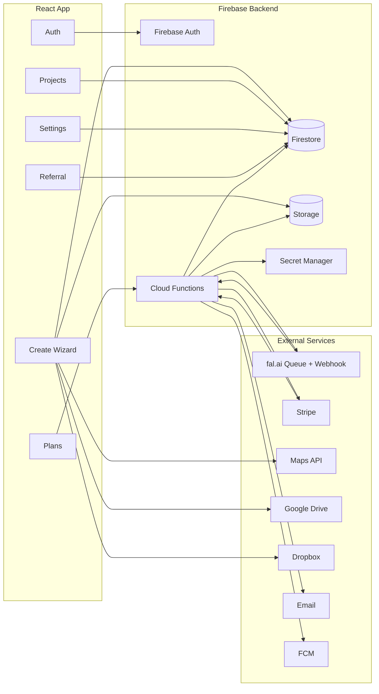

# Product Architecture & Execution Plan

---

## 1. Resources Required

### Firebase / GCP (via Firebase project)
- Firebase Authentication
- Firestore (Native mode)
- Firebase Storage
- Cloud Functions (Node.js, HTTP + Webhooks)
- Secret Manager
- Cloud Logging

### External Services
- fal.ai Queue API (Model: `fal-ai/kling-video/v2.5-turbo/pro/image-to-video`)
- Stripe (Checkout + Webhooks)
- Google Maps (Places Autocomplete + Map)
- Google Drive Picker
- Dropbox Picker
- Email provider (SendGrid / Postmark)
- Firebase Cloud Messaging (Push notifications)

---

## 2. System Architecture

---

## 3. Task-by-Task Breakdown

### Phase 0 — Platform Setup
- Create Firebase project
- Enable Auth, Firestore, Storage, Functions
- Configure security rules
- Configure secrets:
  - FAL_KEY
  - STRIPE_SECRET_KEY
  - STRIPE_WEBHOOK_SECRET
  - FAL_WEBHOOK_SECRET

---

### Phase 1 — User & Project Foundation
- Auth flows (login/signup)
- Create `users/{uid}` on signup
- Project CRUD
- Photo upload & ordering
- Logo upload
- Projects list (basic)

---

### Phase 2 — Video Generation (Core)
- Job model (`jobs`)
- `createVideoJob(projectId)`
  - Verify auth
  - Generate signed image URLs
  - Submit fal queue request with webhook
- `falWebhook`
  - Validate secret
  - Idempotency check
  - Download & store video
  - Update job & project
- Realtime status updates
- Success modal + playback

---

### Phase 3 — Billing & Credits
- Plans configuration
- Stripe checkout
- Stripe webhooks
- Credit ledger
- Free credit toggle
- Unpaid vs paid project states

---

### Phase 4 — Create Wizard Completion
- Branding (logo toggle & picker)
- Music (categories, preview, select)
- Address (autocomplete + map)
- Summary (duration, resolution, fps, quality, cost)

---

### Phase 5 — Referral Program
- Referral code generation
- Apply referral on signup
- Credit reward on payment
- Earnings history
- Credit expiry on access

---

### Phase 6 — Settings & Account
- Profile edit
- Email/password update
- Notification preferences
- Video defaults
- Storage usage
- Active sessions revoke
- 2FA
- Data export
- Account deletion

---