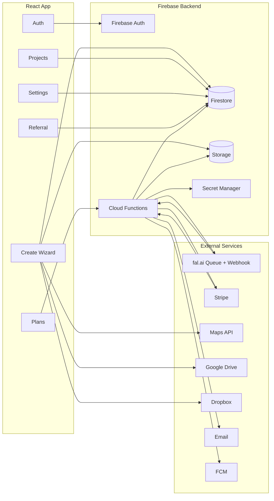

# Product Architecture & Execution Plan

---

## 1. Resources Required

### Firebase / GCP (via Firebase project)
- Firebase Authentication
- Firestore (Native mode)
- Firebase Storage
- Cloud Functions (Node.js, HTTP + Webhooks)
- Secret Manager
- Cloud Logging

### External Services
- fal.ai Queue API (Model: `fal-ai/kling-video/v2.5-turbo/pro/image-to-video`)
- Stripe (Checkout + Webhooks)
- Google Maps (Places Autocomplete + Map)
- Google Drive Picker
- Dropbox Picker
- Email provider (SendGrid / Postmark)
- Firebase Cloud Messaging (Push notifications)

---

## 2. System Architecture



---

## 3. Task-by-Task Breakdown

### Phase 0 — Platform Setup
- Create Firebase project
- Enable Auth, Firestore, Storage, Functions
- Configure security rules
- Configure secrets:
  - FAL_KEY
  - STRIPE_SECRET_KEY
  - STRIPE_WEBHOOK_SECRET
  - FAL_WEBHOOK_SECRET

---

### Phase 1 — User & Project Foundation
- Auth flows (login/signup)
- Create `users/{uid}` on signup
- Project CRUD
- Photo upload & ordering
- Logo upload
- Projects list (basic)

---

### Phase 2 — Video Generation (Core)
- Job model (`jobs`)
- `createVideoJob(projectId)`
  - Verify auth
  - Generate signed image URLs
  - Submit fal queue request with webhook
- `falWebhook`
  - Validate secret
  - Idempotency check
  - Download & store video
  - Update job & project
- Realtime status updates
- Success modal + playback

---

### Phase 3 — Billing & Credits
- Plans configuration
- Stripe checkout
- Stripe webhooks
- Credit ledger
- Free credit toggle
- Unpaid vs paid project states

---

### Phase 4 — Create Wizard Completion
- Branding (logo toggle & picker)
- Music (categories, preview, select)
- Address (autocomplete + map)
- Summary (duration, resolution, fps, quality, cost)

---

### Phase 5 — Referral Program
- Referral code generation
- Apply referral on signup
- Credit reward on payment
- Earnings history
- Credit expiry on access

---

### Phase 6 — Settings & Account
- Profile edit
- Email/password update
- Notification preferences
- Video defaults
- Storage usage
- Active sessions revoke
- 2FA
- Data export
- Account deletion

---

## 4. Firestore Schema

### users/{uid}
```json
{
  "email": "",
  "displayName": "",
  "createdAt": "",
  "stats": {
    "videosCreated": 0,
    "photosUploaded": 0,
    "totalVideoSeconds": 0
  },
  "settings": {
    "notifications": {
      "email": true,
      "projectUpdates": true,
      "marketing": false
    },
    "video": {
      "defaultQuality": "1080p",
      "defaultDurationSeconds": 30,
      "autosave": true
    }
  },
  "subscription": {
    "planId": "",
    "status": "",
    "stripeCustomerId": "",
    "storageQuotaBytes": 0
  },
  "credits": {
    "availableSeconds": 0,
    "usedSeconds": 0
  },
  "referral": {
    "code": "",
    "totalReferrals": 0
  }
}
```

---

### projects/{projectId}
```json
{
  "uid": "",
  "title": "",
  "status": "draft",
  "stepState": {
    "photos": false,
    "branding": false,
    "music": false,
    "address": false,
    "summary": false
  },
  "branding": {
    "enabled": false,
    "logoAssetId": null
  },
  "music": {
    "enabled": false,
    "trackAssetId": null
  },
  "address": {
    "text": "",
    "placeId": "",
    "lat": 0,
    "lng": 0
  },
  "videoConfig": {
    "durationSeconds": 15,
    "resolution": "1920x1080",
    "fps": 30,
    "quality": "high"
  },
  "billing": {
    "useFreeCredit": false,
    "paymentStatus": "not_required"
  },
  "output": {
    "videoAssetId": null
  }
}
```

---

### projects/{projectId}/photos/{photoId}
```json
{
  "storagePath": "",
  "source": "manual",
  "orderIndex": 0,
  "createdAt": ""
}
```

---

### jobs/{jobId}
```json
{
  "uid": "",
  "projectId": "",
  "status": "running",
  "falModel": "fal-ai/kling-video/v2.5-turbo/pro/image-to-video",
  "falRequestId": "",
  "input": {
    "prompt": "",
    "imageUrls": [],
    "aspectRatio": "16:9",
    "duration": 10
  },
  "output": {
    "videoAssetId": null
  },
  "createdAt": ""
}
```

---

### assets/{assetId}
```json
{
  "uid": "",
  "type": "video",
  "storagePath": "",
  "meta": {}
}
```

---

### plans/{planId}
```json
{
  "name": "",
  "price": 0,
  "currency": "USD",
  "stripePriceId": "",
  "videoSecondsIncluded": 0,
  "storageQuotaBytes": 0
}
```

---

### credit_ledger/{entryId}
```json
{
  "uid": "",
  "deltaSeconds": 0,
  "source": "referral",
  "status": "available",
  "expiresAt": ""
}
```

---

### referrals/{referralId}
```json
{
  "referrerUid": "",
  "refereeUid": "",
  "status": "pending",
  "earnedSeconds": 0,
  "createdAt": ""
}
```

---

### payments/{paymentId}
```json
{
  "uid": "",
  "amount": 0,
  "currency": "USD",
  "stripePaymentIntentId": "",
  "status": "succeeded"
}
```
